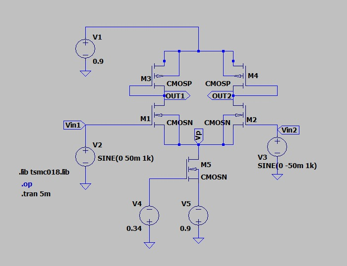
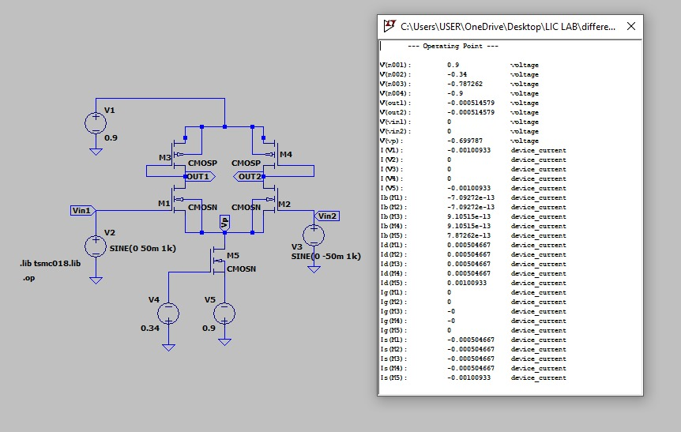
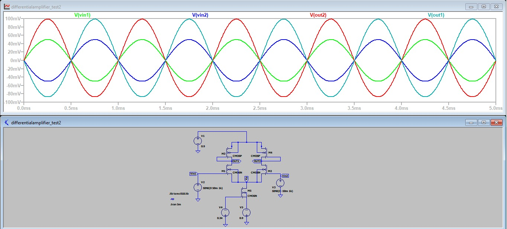
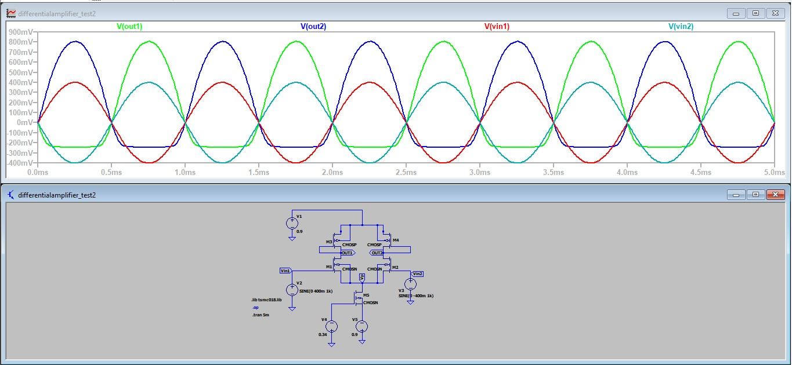

# 🔷 Experiment 4  
## CMOS Differential Amplifier – Design and Analysis (180 nm)

---

## 🎯 Aim

To design a CMOS differential amplifier and analyze its operation using DC conditions based on given specifications.

---

## 📘 Introduction

A differential amplifier is an important analog circuit that amplifies the voltage difference between two input signals while rejecting common noise present at both inputs.

Such amplifiers are widely used in analog systems like operational amplifiers and signal processing circuits due to their high noise immunity and stability.

---

## 📖 Theory

A differential amplifier consists of two matched MOSFETs connected with a common source node and a tail current element.

When a differential input is applied:

vd = Vin1 − Vin2  

- If Vin1 increases → current through M1 increases  
- If Vin2 increases → current through M2 increases  

For small input signals, both transistors operate in saturation and the circuit behaves linearly.

The small-signal gain is given by:

Av = gm × Rout  

where:

- gm = transconductance  
- Rout = effective output resistance  

and,

gm = (2ID) / Vov  

---
## 🔷 Circuit Diagram

---
## 📌 Design Calculations

### 🔸 Given Parameters

| Parameter | Value |
|----------|------|
| Technology | TSMC 180 nm |
| VDD | +0.9 V |
| VSS | -0.9 V |
| Power (P) | 1.8 mW |
| Channel Length (L) | 480 nm |
| Vth | 0.36 V |
| Load Capacitance | 10 pF |

---

### 🔸 Total Supply Voltage

Vtotal = VDD − VSS  

Vtotal = 0.9 − (−0.9) = 1.8 V  

---

### 🔸 Tail Current (ISS)

Using power relation:

P = Vtotal × ISS  

ISS = 1.8 mW / 1.8 V  

ISS = 1 mA  

---

### 🔸 Drain Current

For balanced differential pair:

ID1 = ID2 = ISS / 2  

ID = 0.5 mA  

---

### 🔸 Load Resistance (RD)

Using:

Vout = VDD − ID × RD  

Assuming symmetric output:

Vout ≈ 0 V  

0 = 0.9 − (0.5 mA × RD)

RD = 0.9 / (0.5 × 10⁻³)

RD ≈ 1.8 kΩ  

---

### 🔸 Bias Point Calculation

#### Source Voltage

Given:

Vp = −0.7 V  

Vs = Vp = −0.7 V  

---

#### Gate Voltage

For DC condition:

VG1 = VG2 = 0 V  

---

#### Gate-Source Voltage

VGS = VG − VS  

VGS = 0 − (−0.7)  

VGS = 0.7 V  

---

#### Overdrive Voltage

VOV = VGS − Vth  

VOV = 0.7 − 0.36  

VOV = 0.34 V  

---

#### Drain Voltage

Vout = 0 V  

---

#### Drain-Source Voltage

VDS = VD − VS  

VDS = 0 − (−0.7)  

VDS = 0.7 V  

---

### 🔸 Saturation Check

Condition:

VDS ≥ VOV  

0.7 ≥ 0.34  ✔  

👉 Both transistors operate in saturation region

---

### 🔸 Width Calculation

Using MOSFET equation:

ID = (1/2) μnCox (W/L) (VOV)²  

Rewriting:

W = (2 ID L) / (μnCox (VOV)²)

Initial value:

W ≈ 17.5 µm  

### 🔸 Width Tuning and Practical Adjustment

The width obtained from theoretical calculation is based on ideal square-law MOSFET assumptions.  
However, practical device behavior deviates due to several non-ideal effects.

To achieve the required bias condition:

Vs ≈ -0.7 V  

the transistor width was adjusted through simulation.

By varying W, the drain current was controlled such that the desired source voltage and operating point were accurately obtained.

| Condition | Width |
|----------|------|
| Initial calculated width | ≈ 17.5 µm |
| Final tuned width | ≈ 28.5 µm |

---

### 🔸 Reason for Deviation

The difference between theoretical and simulated width occurs due to:

- Channel length modulation (λ effect)
- Mobility degradation at higher fields
- Non-ideal MOSFET behavior in 180 nm technology
- Process variations in model parameters
- Influence of parasitic capacitances

Hence, width tuning is necessary to meet exact design specifications in simulation.
## 🔷 DC Analysis

The DC operating point analysis is performed to verify whether all transistors are properly biased in saturation.

From the simulation results:

- Drain voltages are close to the expected operating value
- Source node voltage is maintained by the tail current source
- Equal current distribution is observed in both branches

✔ This confirms correct biasing and stable operation of the differential amplifier.

---

## 🔷 Input Common Mode Range (ICMR)

The input common-mode range defines the allowable range of input voltage for which the circuit operates correctly.

### 🔹 Minimum Input Voltage

For proper operation:

Vgs ≥ Vth  

Since:

Vgs = Vcm − Vs  

Therefore:

Vcm(min) = Vs + Vth  

Substituting values:

Vcm(min) = -0.7 + 0.36 = **-0.34 V**

---

### 🔹 Maximum Input Voltage

To keep NMOS in saturation:

Vds ≥ Vov  

Using:

Vds = Vd − Vs  

From bias point:

Vds ≈ 0.7 V  

Thus:

Vcm(max) = Vd + Vth = **0.36 V**

---

### ✅ Final ICMR

| Parameter | Value |
|----------|------|
| Vcm(min) | -0.34 V |
| Vcm(max) | 0.36 V |

---

## 🔷 Output Common Mode Range

The output voltage limits are determined by maintaining transistor saturation.

### 🔹 Maximum Output Voltage

Limited by supply voltage:

Vout(max) ≈ VDD = **0.9 V**

---

### 🔹 Minimum Output Voltage

Condition:

Vds ≥ Vov  

So:

Vout(min) = Vs + Vov  

Substituting:

Vout(min) = -0.7 + 0.34 = **-0.36 V**

---

### ✅ Final Output Range

| Parameter | Value |
|----------|------|
| Vout(min) | -0.36 V |
| Vout(max) | 0.9 V |

---

## 🔷 Differential Input Range (Linear Region)

For linear operation:

|Vid| ≤ 2Vov  

Given:

Vov = 0.34 V  

Therefore:

|Vid| ≤ 0.68 V  

---

### ✅ Linear Operating Range

| Parameter | Value |
|----------|------|
| Maximum differential input | ±0.68 V |

---

## 🔷 Transient Analysis

Transient analysis is performed to verify linearity of the amplifier under different input conditions.

---

### 🔹 Case 1: Small Signal Input (Linear Region)

Input applied:

Vid = 50 mV (< 0.68 V)

#### Observation:

- Output is clean sinusoidal
- No distortion observed
- Both transistors operate in saturation
- Gain remains constant

---

### 🔹 Case 2: Large Signal Input (Non-Linear Region)

Input applied:

Vid = 500 mV (> 0.68 V)

#### Observation:

- Output waveform shows distortion
- Clipping is observed
- One transistor moves towards cutoff
- Linear amplification is lost

---

## 🔷 Comparison of Operation

| Parameter | Linear Region | Non-Linear Region |
|----------|-------------|------------------|
| MOSFET Operation            | Both in saturation           | One in cutoff, one active    |
| Current Distribution        | Equal sharing                | Unequal (one dominates)      |
| Output Waveform             | Sinusoidal                   | Distorted / non-linear       |
| Linearity                   | Linear region               | Non-linear region            |
| Gain Behavior               | Constant                    | Varies (non-linear gain)     |
| Symmetry                    | Symmetrical                 | Asymmetrical                 |
| Signal Quality              | High (clean output)         | Poor (clipping/distortion)   |

---

## 🔷 Interpretation

When the input difference is small, current splits equally and the amplifier behaves linearly.

As the input increases, current shifts toward one transistor, causing imbalance and distortion.

---

## 🔷 Conclusion

The differential amplifier operates linearly only within a limited input range.

✔ Linear condition:

|Vid| < 2Vov  

Beyond this limit:

- One transistor turns off  
- Output becomes non-linear  
- Gain reduces  

Thus, proper input range selection is essential for accurate amplification.
## 🔷 Gain Calculation (From Transient Analysis)

The output waveform is amplified and inverted with respect to the input signal.

### 🔹 Input Signal Parameters

| Parameter | Value |
|----------|------|
| Type | Sine wave |
| Frequency | 1 kHz |
| Amplitude | 50 mV (differential) |
| DC Offset | 0 V |

---

### 🔹 Measured Peak-to-Peak Values

| Quantity | Value |
|----------|------|
| Vin (p-p) | 100 mV |
| Vout (p-p) | 604 mV |

---

### 🔹 Voltage Gain

Av = Vout(p-p) / Vin(p-p)

Av = 604 mV / 100 mV  

Av = 6.04 V/V

---

### 🔹 Gain in dB

Gain(dB) = 20 log10(Av)

Gain(dB) = 20 log10(6.04)

Gain ≈ 15.62 dB

---

## 🔷 Theoretical Gain Estimation

### 🔹 Output Resistance

ro = 1 / (λ × ID)

Given:  
λ = 0.1 V⁻¹  
ID = 0.5 mA  

ro = 1 / (0.1 × 0.5 × 10⁻³)

ro = 20 kΩ

---

### 🔹 Effective Output Resistance

ro(eff) = ro1 || ro2  

ro(eff) = 20k || 20k  

ro(eff) = 10 kΩ

---

### 🔹 Transconductance

gm = 2ID / Vov  

(Use your Vov value)

---

### 🔹 Theoretical Gain

Av = gm × ro(eff)

NOTE: This is an approximate value due to ideal assumptions.

---

## 🔷 AC Analysis

The frequency response of the amplifier is obtained using AC analysis.

---

### 🔹 Extracted Parameters

| Parameter | Value |
|----------|------|
| Midband Gain | 9.87 dB |
| 3 dB Gain | 6.87 dB |
| Lower Cutoff Frequency | ~ 0 Hz |
| Upper Cutoff Frequency | 4.819 MHz |

---

### 🔹 Bandwidth

Bandwidth (BW) = fH − fL  

BW = 4.819 MHz

---

## 🔷 Observations

- Gain is constant in midband region  
- Gain decreases at high frequencies  
- Roll-off occurs due to parasitic capacitances  
- Bandwidth depends on output node capacitance  

---

## 🔷 Reason for Variation

The difference between theoretical and simulated results is due to:

- Channel length modulation  
- Mobility degradation  
- Parasitic capacitances  
- Non-ideal MOSFET behavior  
- Approximation in hand calculations  

---

## 🔷 Inference

The differential amplifier with resistive load is successfully designed and analyzed.

### 🔹 Key Points

- Power constraint is satisfied  
- Tail current ensures proper biasing  
- Both transistors operate in saturation  
- Gain is moderate due to resistive load  
- Bandwidth is relatively high  

---

### 🔹 Performance Summary

| Parameter | Value |
|----------|------|
| Gain (V/V) | 6.04 |
| Gain (dB) | 15.62 dB |
| Bandwidth | 4.819 MHz |

---

### 🔹 Final Conclusion

- For small input → amplifier behaves linearly  
- For large input → distortion occurs  
- Gain is limited by output resistance  
- Bandwidth is affected by parasitics  

Thus, the circuit meets the design requirements and shows expected behavior.

# 🔷 Circuit 2: Differential Amplifier with PMOS Active Load

---

## 🔶 Working Principle

This circuit uses:

- NMOS (M1, M2) → differential pair  
- PMOS (M3, M4) → active load  
- NMOS (M5) → tail current source  

When a differential input is applied:

- Tail current splits between M1 and M2  
- PMOS load converts current variation into voltage  
- Output is taken from drains of M1 and M2  

✔ Active load increases output resistance → higher gain  

---

## 🔶 Circuit Diagram

---

## 🔶 Design Parameters

| Parameter | Value |
|----------|------|
| Technology | 180 nm |
| VDD | +0.9 V |
| VSS | -0.9 V |
| Power Limit | 1.8 mW |
| Channel Length (L) | 480 nm |
| Vcm (input) | 0 V |
| Vout (target) | 0 V |
| Tail Voltage (Vp) | -0.7 V |
| Threshold Voltage (Vth) | 0.36 V |

---

## 🔶 Power Constraint

Total supply voltage:

VDD − VSS = 0.9 − (−0.9) = **1.8 V**

Power relation:

P = (VDD − VSS) × Iss  

So,

1.8 × Iss ≤ 1.8 mW  

Iss ≤ 1 mA  

✔ Choose:

Iss = **1 mA**

---

## 🔶 Drain Current Distribution

Under balanced condition:

Vin1 = Vin2  

Current splits equally:

| Quantity | Value |
|---------|------|
| ID1 | 0.5 mA |
| ID2 | 0.5 mA |

✔ Symmetrical operation achieved  

---

## 🔶 Bias Point (Initial Understanding)

| Node | Value |
|------|------|
| Vin1 = Vin2 | 0 V |
| Vs (tail node) | -0.7 V |

---

### 🔹 Gate-Source Voltage

Vgs = Vg − Vs  

Vgs = 0 − (−0.7)  

Vgs = **0.7 V**

---

### 🔹 Overdrive Voltage

Vov = Vgs − Vth  

Vov = 0.7 − 0.36  

Vov = **0.34 V**

---

✔ This ensures transistors operate in saturation region  

---
## Bias Completion

### NMOS (M1, M2)

| Parameter | Value |
|----------|------|
| Vd | 0 V |
| Vs | -0.7 V |
| Vds | 0.7 V |
| Vov | 0.34 V |

Condition:  
Vds ≥ Vov → 0.7 ≥ 0.34 ✔  

✔ M1, M2 operate in saturation  

---

### NMOS Tail Current Source (M5)

| Node | Value |
|------|------|
| Vs | -0.9 V |
| Vd | -0.7 V |

Vds = Vd − Vs = -0.7 − (-0.9) = **0.2 V**

To keep M5 in saturation:

Vds ≥ Vov  

Choose:

Vov ≈ **0.2 V**

---

#### Gate Voltage

Vgs = Vth + Vov  
Vgs = 0.36 + 0.2 = **0.56 V**

Vg = Vs + Vgs  
Vg = -0.9 + 0.56 = **-0.34 V**

✔ M5 operates at edge of saturation and sets tail current  

---

### PMOS Load (M3, M4)

| Parameter | Value |
|----------|------|
| Vs | 0.9 V |
| Vd | 0 V |
| Vsd | 0.9 V |

Condition:

Vsd ≥ Vov  

✔ 0.9 V is sufficient → PMOS in saturation  

---

### Final Bias Summary

| Device | Region |
|--------|-------|
| M1, M2 | Saturation |
| M3, M4 | Saturation |
| M5 | Saturation (edge) |

✔ Proper differential operation achieved  

---

## Width Calculation

General equation:

ID = (1/2) μCox (W/L) (Vov)²  

Rearranged:

W = (2 ID L) / (μCox (Vov)²)

---

### NMOS (M1, M2)

| Parameter | Value |
|----------|------|
| ID | 0.5 mA |
| Vov | 0.34 V |
| L | 480 nm |

Calculated:

W ≈ **17.6 µm**

---

### NMOS (M5)

| Parameter | Value |
|----------|------|
| ID | 1 mA |
| Vov | 0.2 V |
| L | 480 nm |

Calculated:

W ≈ **101.5 µm**

---

### Width Tuning (From Simulation)

Due to non-ideal effects, widths are adjusted:

| Transistor | Initial | Final |
|-----------|--------|------|
| M1, M2 | 17.6 µm | ~29.8 µm |
| M5 | 101.5 µm | ~195 µm |

---

### Reason for Adjustment

- Channel length modulation  
- Mobility variation  
- Model inaccuracies  
- Exact bias matching requirement  

✔ Final values ensure correct tail current and node voltage
## DC Analysis

The operating point verifies that all node voltages and currents are close to the designed values.  
The tail current splits almost equally, confirming proper biasing of the differential pair.

✔ Both NMOS and PMOS transistors operate in saturation  

---

## Input Common Mode Range (ICMR)

ICMR defines the range of input voltage for which the circuit functions correctly.

### Minimum Input Voltage

Condition:
Vgs ≥ Vt  

Vgs = Vicm − Vs  

So,

Vicm(min) = Vs + Vt  

| Parameter | Value |
|----------|------|
| Vs | -0.7 V |
| Vt | 0.36 V |

Vicm(min) = **-0.34 V**

---

### Maximum Input Voltage

To keep PMOS active load in saturation:

Vsd ≥ Vov  

After simplification:

Vicm(max) ≈ Vd + |Vtp|

| Parameter | Value |
|----------|------|
| Vd | ~0 V |
| |Vtp| | ~0.39 V |

Vicm(max) = **0.39 V**

---

### Final ICMR

| Range |
|------|
| **-0.34 V ≤ Vicm ≤ 0.39 V** |

---

## Output Common Mode Range (OCMR)

### Minimum Output Voltage

Condition for NMOS saturation:

Vds ≥ Vov  

Vout(min) ≥ Vs + Vov  

| Parameter | Value |
|----------|------|
| Vs | -0.7 V |
| Vov | 0.34 V |

Vout(min) = **-0.36 V**

---

### Maximum Output Voltage

Condition for PMOS:

Vsd ≥ Vov  

Vout(max) ≤ VDD − Vov  

| Parameter | Value |
|----------|------|
| VDD | 0.9 V |
| Vov(p) | 0.25 V |

Vout(max) = **0.65 V**

---

### Final OCMR

| Range |
|------|
| **-0.36 V ≤ Vout ≤ 0.65 V** |

---

## Differential Input Range (Linear Region)

For linear operation:

|Vid| ≤ 2Vov  

| Parameter | Value |
|----------|------|
| Vov | 0.25 V |

Vid(max) = **0.5 V**

---

### Final Range

| Range |
|------|
| **-0.5 V ≤ Vid ≤ 0.5 V** |

---

## Transient Analysis

### Linearity Condition

|Vid| < √2 · Vov  

| Parameter | Value |
|----------|------|
| Vov | 0.24 V |

√2 · Vov ≈ **0.34 V**

---

### Case 1: Linear Region

Input applied:

Vid = 100 mV (< 0.34 V)

✔ Output is clean and sinusoidal  
✔ Both branches conduct equally  
✔ Amplifier behaves linearly  

---

### Case 2: Non-Linear Region

Input applied:

Vid = 600 mV (> 0.34 V)

✔ Output shows distortion  
✔ One transistor turns OFF  
✔ Current shifts to one side  

---

## Comparison

| Parameter | Linear | Non-Linear |
|----------|--------|-----------|
| Input | Small | Large |
| Output | Smooth | Distorted |
| Gain | Constant | Reduced |
| Operation | Balanced | Unbalanced |

---
## Interpretation

For small differential inputs, both NMOS transistors conduct simultaneously and the tail current is shared almost equally between the two branches. This results in a proportional and linear output.

As the input difference increases, the current distribution becomes uneven. One transistor starts dominating while the other approaches cutoff, leading to distortion in the output waveform.

---

## Simulated Gain

### Input Conditions

| Parameter | Value |
|----------|------|
| Signal Type | Sine |
| Frequency | 1 kHz |
| Differential Amplitude | 50 mV |
| DC Offset | 0 V |

---

### Measured Values

| Quantity | Value |
|---------|------|
| Vin(p-p) | 100 mV |
| Vout(p-p) | ≈ 180 mV |

---

### Gain Calculation

Av = Vout / Vin  

Av ≈ 180m / 100m  

Av ≈ **1.8**

---

### Gain in dB

Av(dB) = 20 log(1.8)  

Av(dB) ≈ **5.1 dB**

---

## Theoretical Gain

### Output Resistance

ro = 1 / (λ Id)

| Parameter | Value |
|----------|------|
| λ | 0.1 V⁻¹ |
| Id | 0.5 mA |

ro ≈ 20 kΩ  

Effective resistance:

ro_eff ≈ ro || ro ≈ **10 kΩ**

---

### Transconductance

gm = 2Id / Vov  

| Parameter | Value |
|----------|------|
| Id | 0.5 mA |
| Vov | ≈ 0.25 V |

gm ≈ **4 mS**

---

### Gain

Av = gm × Rout  

Av ≈ 4 × 10⁻³ × 10 × 10³  

Av ≈ **40**

---

### Gain in dB

Av(dB) ≈ **32 dB**

---

## Reason for Difference (Theory vs Simulation)

The difference between theoretical and simulated gain is expected due to practical device behavior.

- Channel length modulation reduces output resistance  
- Active load is not perfectly ideal  
- Mobility degradation lowers gm  
- Tail current source is non-ideal  
- Parasitic capacitances affect signal behavior  
- Measurement from waveform introduces small errors  

👉 Hence, simulated gain is lower than theoretical value.

---

## AC Analysis

The frequency response shows a flat region at mid frequencies followed by a roll-off at higher frequencies.

---

### Midband Gain

Av ≈ **5 dB**

---

### Cutoff Frequencies

| Parameter | Value |
|----------|------|
| Lower cutoff (fL) | ~0 Hz |
| Upper cutoff (fH) | ≈ 2.2 GHz |

---

### Bandwidth

BW = fH − fL  

BW ≈ **2.2 GHz**

---

## Key Observation

- Gain remains constant in midband region  
- At higher frequencies, gain decreases due to parasitic effects  
- Active load introduces additional poles in response  

---

## Inference

The differential amplifier with PMOS active load and NMOS current source was successfully designed and analyzed.

✔ Power constraint is satisfied  
✔ Proper biasing ensures all transistors operate in saturation  
✔ Tail current splits equally under balanced input  
✔ Linear amplification is achieved for small signals  

However:

- Simulated gain is lower than theoretical due to non-ideal effects  
- Active load and current source introduce finite resistance  
- At larger inputs, distortion appears due to current steering  

👉 Overall, the circuit demonstrates correct operation with expected practical limitations.

