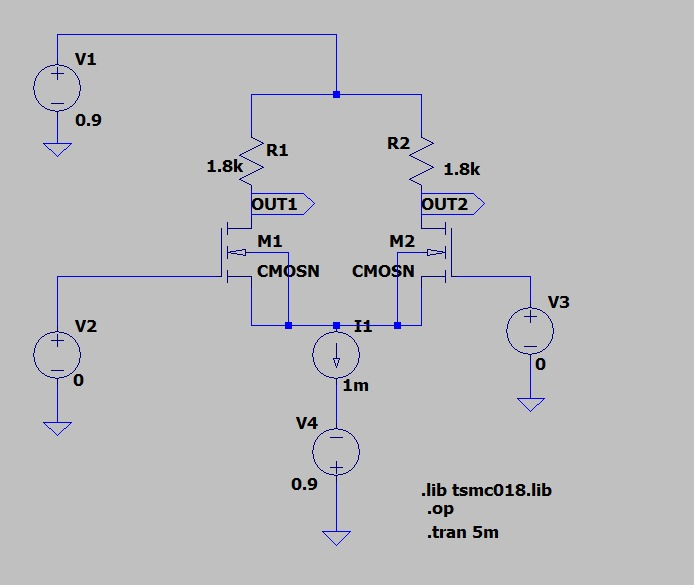
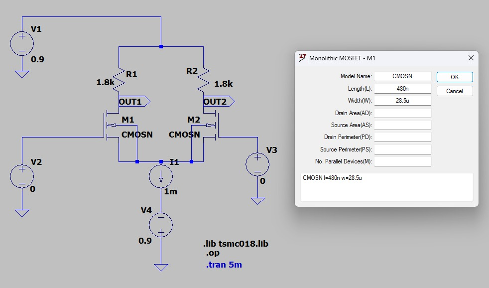
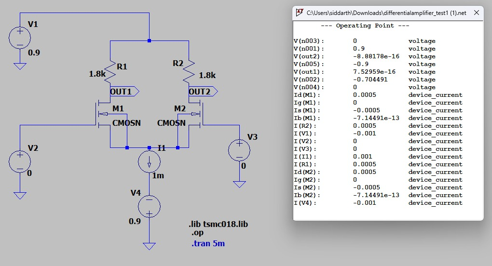
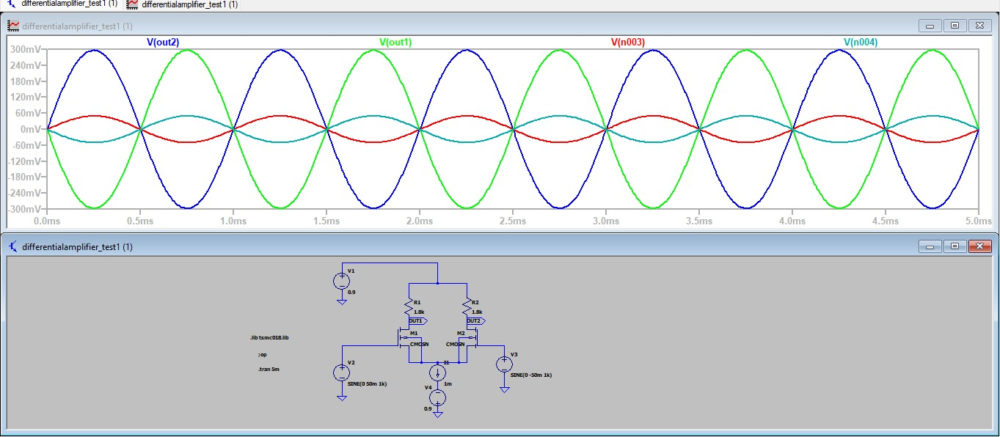
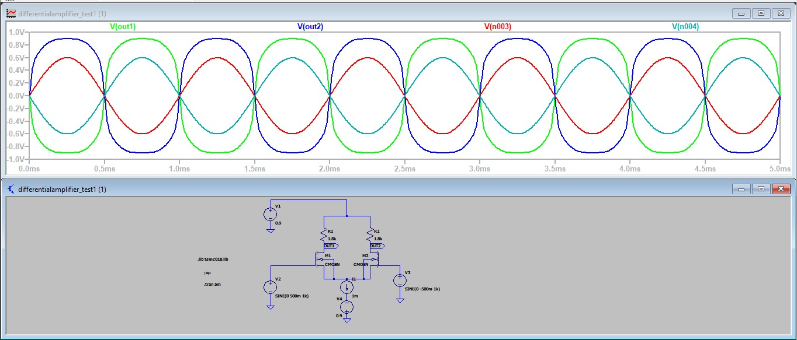
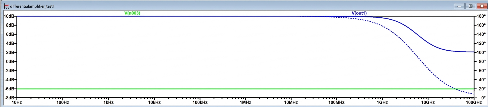

# 🔷 Experiment 4  
## CMOS Differential Amplifier – Design and Analysis (180 nm)

---

## 🎯 Aim

To design a CMOS differential amplifier and analyze its operation using DC conditions based on given specifications.

---

## 📘 Introduction

A differential amplifier is an important analog circuit that amplifies the voltage difference between two input signals while rejecting common noise present at both inputs.

Such amplifiers are widely used in analog systems like operational amplifiers and signal processing circuits due to their high noise immunity and stability.

---

## 📖 Theory

A differential amplifier consists of two matched MOSFETs connected with a common source node and a tail current element.

When a differential input is applied:

vd = Vin1 − Vin2  

- If Vin1 increases → current through M1 increases  
- If Vin2 increases → current through M2 increases  

For small input signals, both transistors operate in saturation and the circuit behaves linearly.

The small-signal gain is given by:

Av = gm × Rout  

where:

- gm = transconductance  
- Rout = effective output resistance  

and,

gm = (2ID) / Vov  

---
## 🔷 Circuit Diagram

---
## 📌 Design Calculations

### 🔸 Given Parameters

| Parameter | Value |
|----------|------|
| Technology | TSMC 180 nm |
| VDD | +0.9 V |
| VSS | -0.9 V |
| Power (P) | 1.8 mW |
| Channel Length (L) | 480 nm |
| Vth | 0.36 V |
| Load Capacitance | 10 pF |

---

### 🔸 Total Supply Voltage

Vtotal = VDD − VSS  

Vtotal = 0.9 − (−0.9) = 1.8 V  

---

### 🔸 Tail Current (ISS)

Using power relation:

P = Vtotal × ISS  

ISS = 1.8 mW / 1.8 V  

ISS = 1 mA  

---

### 🔸 Drain Current

For balanced differential pair:

ID1 = ID2 = ISS / 2  

ID = 0.5 mA  

---

### 🔸 Load Resistance (RD)

Using:

Vout = VDD − ID × RD  

Assuming symmetric output:

Vout ≈ 0 V  

0 = 0.9 − (0.5 mA × RD)

RD = 0.9 / (0.5 × 10⁻³)

RD ≈ 1.8 kΩ  

---

### 🔸 Bias Point Calculation

#### Source Voltage

Given:

Vp = −0.7 V  

Vs = Vp = −0.7 V  

---

#### Gate Voltage

For DC condition:

VG1 = VG2 = 0 V  

---

#### Gate-Source Voltage

VGS = VG − VS  

VGS = 0 − (−0.7)  

VGS = 0.7 V  

---

#### Overdrive Voltage

VOV = VGS − Vth  

VOV = 0.7 − 0.36  

VOV = 0.34 V  

---

#### Drain Voltage

Vout = 0 V  

---

#### Drain-Source Voltage

VDS = VD − VS  

VDS = 0 − (−0.7)  

VDS = 0.7 V  

---

### 🔸 Saturation Check

Condition:

VDS ≥ VOV  

0.7 ≥ 0.34  ✔  

👉 Both transistors operate in saturation region

---

### 🔸 Width Calculation

Using MOSFET equation:

ID = (1/2) μnCox (W/L) (VOV)²  

Rewriting:

W = (2 ID L) / (μnCox (VOV)²)

Initial value:

W ≈ 17.5 µm  

### 🔸 Width Tuning and Practical Adjustment

The width obtained from theoretical calculation is based on ideal square-law MOSFET assumptions.  
However, practical device behavior deviates due to several non-ideal effects.

To achieve the required bias condition:

Vs ≈ -0.7 V  

the transistor width was adjusted through simulation.

By varying W, the drain current was controlled such that the desired source voltage and operating point were accurately obtained.

| Condition | Width |
|----------|------|
| Initial calculated width | ≈ 17.5 µm |
| Final tuned width | ≈ 28.5 µm |

---

### 🔸 Reason for Deviation

The difference between theoretical and simulated width occurs due to:

- Channel length modulation (λ effect)
- Mobility degradation at higher fields
- Non-ideal MOSFET behavior in 180 nm technology
- Process variations in model parameters
- Influence of parasitic capacitances

Hence, width tuning is necessary to meet exact design specifications in simulation.
## 🔷 DC Analysis

The DC operating point analysis is performed to verify whether all transistors are properly biased in saturation.

From the simulation results:

- Drain voltages are close to the expected operating value
- Source node voltage is maintained by the tail current source
- Equal current distribution is observed in both branches

✔ This confirms correct biasing and stable operation of the differential amplifier.

---

## 🔷 Input Common Mode Range (ICMR)

The input common-mode range defines the allowable range of input voltage for which the circuit operates correctly.

### 🔹 Minimum Input Voltage

For proper operation:

Vgs ≥ Vth  

Since:

Vgs = Vcm − Vs  

Therefore:

Vcm(min) = Vs + Vth  

Substituting values:

Vcm(min) = -0.7 + 0.36 = **-0.34 V**

---

### 🔹 Maximum Input Voltage

To keep NMOS in saturation:

Vds ≥ Vov  

Using:

Vds = Vd − Vs  

From bias point:

Vds ≈ 0.7 V  

Thus:

Vcm(max) = Vd + Vth = **0.36 V**

---

### ✅ Final ICMR

| Parameter | Value |
|----------|------|
| Vcm(min) | -0.34 V |
| Vcm(max) | 0.36 V |

---

## 🔷 Output Common Mode Range

The output voltage limits are determined by maintaining transistor saturation.

### 🔹 Maximum Output Voltage

Limited by supply voltage:

Vout(max) ≈ VDD = **0.9 V**

---

### 🔹 Minimum Output Voltage

Condition:

Vds ≥ Vov  

So:

Vout(min) = Vs + Vov  

Substituting:

Vout(min) = -0.7 + 0.34 = **-0.36 V**

---

### ✅ Final Output Range

| Parameter | Value |
|----------|------|
| Vout(min) | -0.36 V |
| Vout(max) | 0.9 V |

---

## 🔷 Differential Input Range (Linear Region)

For linear operation:

|Vid| ≤ 2Vov  

Given:

Vov = 0.34 V  

Therefore:

|Vid| ≤ 0.68 V  

---

### ✅ Linear Operating Range

| Parameter | Value |
|----------|------|
| Maximum differential input | ±0.68 V |

---

## 🔷 Transient Analysis

Transient analysis is performed to verify linearity of the amplifier under different input conditions.

---

### 🔹 Case 1: Small Signal Input (Linear Region)

Input applied:

Vid = 50 mV (< 0.68 V)

#### Observation:

- Output is clean sinusoidal
- No distortion observed
- Both transistors operate in saturation
- Gain remains constant

---

### 🔹 Case 2: Large Signal Input (Non-Linear Region)

Input applied:

Vid = 500 mV (> 0.68 V)

#### Observation:

- Output waveform shows distortion
- Clipping is observed
- One transistor moves towards cutoff
- Linear amplification is lost

---

## 🔷 Comparison of Operation

| Parameter | Linear Region | Non-Linear Region |
|----------|-------------|------------------|
| MOSFET Operation            | Both in saturation           | One in cutoff, one active    |
| Current Distribution        | Equal sharing                | Unequal (one dominates)      |
| Output Waveform             | Sinusoidal                   | Distorted / non-linear       |
| Linearity                   | Linear region               | Non-linear region            |
| Gain Behavior               | Constant                    | Varies (non-linear gain)     |
| Symmetry                    | Symmetrical                 | Asymmetrical                 |
| Signal Quality              | High (clean output)         | Poor (clipping/distortion)   |

---

## 🔷 Interpretation

When the input difference is small, current splits equally and the amplifier behaves linearly.

As the input increases, current shifts toward one transistor, causing imbalance and distortion.

---

## 🔷 Conclusion

The differential amplifier operates linearly only within a limited input range.

✔ Linear condition:

|Vid| < 2Vov  

Beyond this limit:

- One transistor turns off  
- Output becomes non-linear  
- Gain reduces  

Thus, proper input range selection is essential for accurate amplification.
## 🔷 Gain Calculation (From Transient Analysis)

The output waveform is amplified and inverted with respect to the input signal.

### 🔹 Input Signal Parameters

| Parameter | Value |
|----------|------|
| Type | Sine wave |
| Frequency | 1 kHz |
| Amplitude | 50 mV (differential) |
| DC Offset | 0 V |

---

### 🔹 Measured Peak-to-Peak Values

| Quantity | Value |
|----------|------|
| Vin (p-p) | 100 mV |
| Vout (p-p) | 604 mV |

---

### 🔹 Voltage Gain

Av = Vout(p-p) / Vin(p-p)

Av = 604 mV / 100 mV  

Av = 6.04 V/V

---

### 🔹 Gain in dB

Gain(dB) = 20 log10(Av)

Gain(dB) = 20 log10(6.04)

Gain ≈ 15.62 dB

---

## 🔷 Theoretical Gain Estimation

### 🔹 Output Resistance

ro = 1 / (λ × ID)

Given:  
λ = 0.1 V⁻¹  
ID = 0.5 mA  

ro = 1 / (0.1 × 0.5 × 10⁻³)

ro = 20 kΩ

---

### 🔹 Effective Output Resistance

ro(eff) = ro1 || ro2  

ro(eff) = 20k || 20k  

ro(eff) = 10 kΩ

---

### 🔹 Transconductance

gm = 2ID / Vov  

(Use your Vov value)

---

### 🔹 Theoretical Gain

Av = gm × ro(eff)

NOTE: This is an approximate value due to ideal assumptions.

---

## 🔷 AC Analysis

The frequency response of the amplifier is obtained using AC analysis.

---

### 🔹 Extracted Parameters

| Parameter | Value |
|----------|------|
| Midband Gain | 9.87 dB |
| 3 dB Gain | 6.87 dB |
| Lower Cutoff Frequency | ~ 0 Hz |
| Upper Cutoff Frequency | 4.819 MHz |

---

### 🔹 Bandwidth

Bandwidth (BW) = fH − fL  

BW = 4.819 MHz

---

## 🔷 Observations

- Gain is constant in midband region  
- Gain decreases at high frequencies  
- Roll-off occurs due to parasitic capacitances  
- Bandwidth depends on output node capacitance  

---

## 🔷 Reason for Variation

The difference between theoretical and simulated results is due to:

- Channel length modulation  
- Mobility degradation  
- Parasitic capacitances  
- Non-ideal MOSFET behavior  
- Approximation in hand calculations  

---

## 🔷 Inference

The differential amplifier with resistive load is successfully designed and analyzed.

### 🔹 Key Points

- Power constraint is satisfied  
- Tail current ensures proper biasing  
- Both transistors operate in saturation  
- Gain is moderate due to resistive load  
- Bandwidth is relatively high  

---

### 🔹 Performance Summary

| Parameter | Value |
|----------|------|
| Gain (V/V) | 6.04 |
| Gain (dB) | 15.62 dB |
| Bandwidth | 4.819 MHz |

---

### 🔹 Final Conclusion

- For small input → amplifier behaves linearly  
- For large input → distortion occurs  
- Gain is limited by output resistance  
- Bandwidth is affected by parasitics  

Thus, the circuit meets the design requirements and shows expected behavior.
