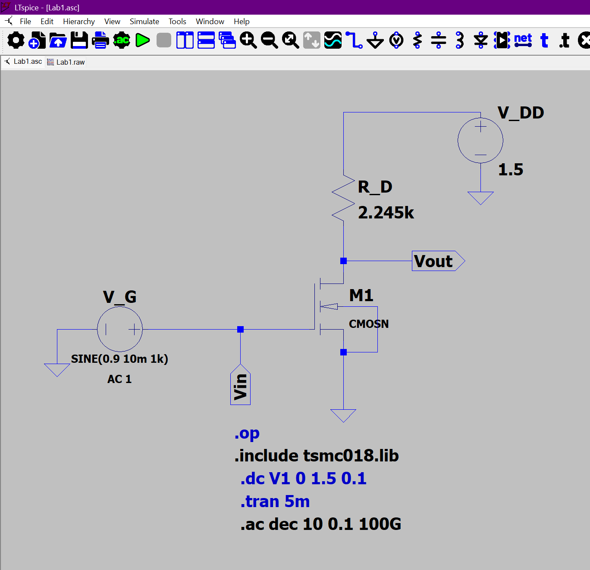
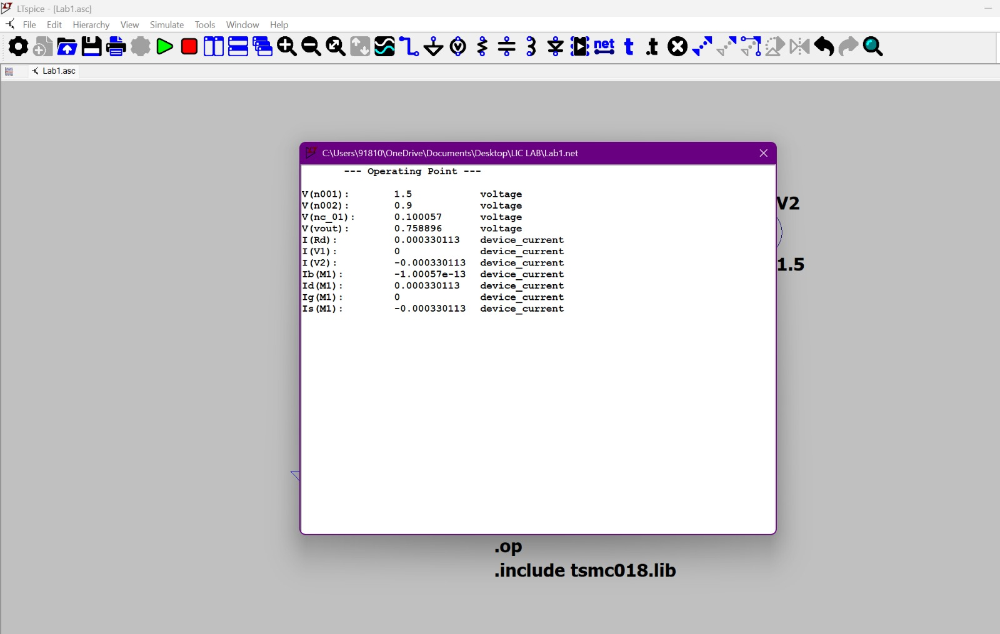
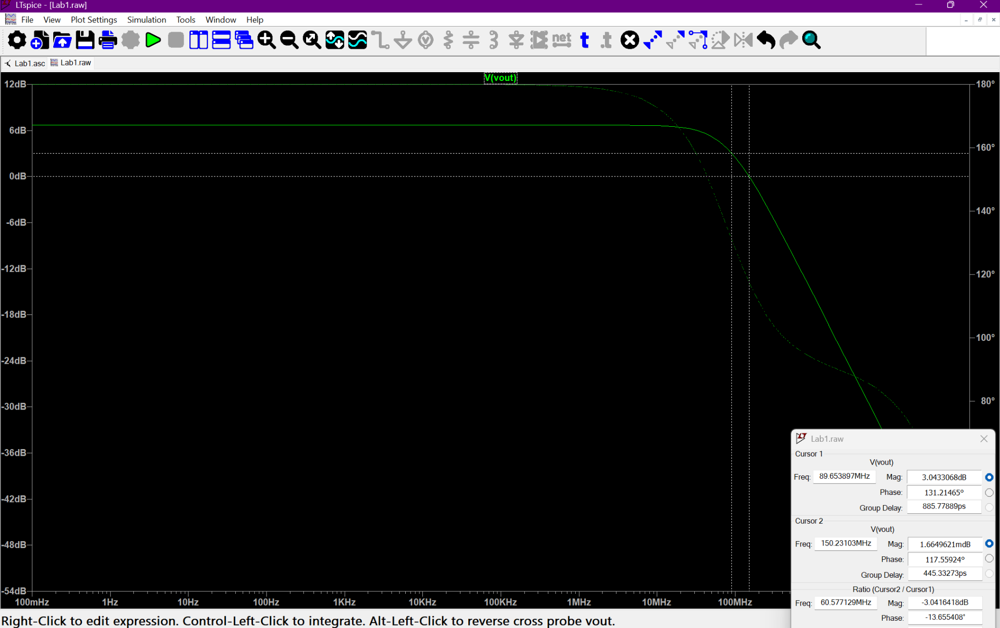

S# Experiment – 1  
## DC, Transient and AC Analysis of Common Source Amplifier using 180nm NMOS in LTspice

---

## AIM :

To design a Common Source (CS) amplifier using 180nm NMOS technology in LTspice and to perform DC, Transient and AC analysis as per the given specifications.

---

## GIVEN SPECIFICATIONS :

- VDD = 1.5 V  
- Power constraint P ≤ 0.5 mW  
- Load capacitor CL = 1 pF  
- Channel length L = 180 nm  
- Technology : 180 nm TSMC library  

---

## COMPONENTS USED :

- NMOS transistor (180nm model)  
- Drain resistor (RD)  
- DC power supply  
- AC signal source  
- Load capacitor (1 pF)  
- Ground and connecting wires  
---

## CIRCUIT DIAGRAM :

The Common Source amplifier circuit was designed in LTspice using 180nm NMOS technology.  
The drain resistor RD is connected between VDD and drain terminal.  
The input signal is applied at the gate terminal and output is taken from the drain.  

---

## THEORY :

A Common Source (CS) amplifier is one of the fundamental MOSFET amplifier configurations.  
In this configuration, the source terminal is grounded, the input is applied at the gate and the output is taken from the drain.
The amplifier provides voltage gain with a phase inversion of 180 degrees between input and output.  
For proper amplification, the MOSFET must operate in the saturation region.  
Therefore, the Q-point is fixed such that VDS ≈ VDD/2 to allow maximum symmetrical output swing.

## PROCEDURE :

1. The 180nm NMOS model file (tsmc018.lib) was included in LTspice using the .include directive.

2. The Common Source amplifier circuit was constructed with:
   - VDD = 1.5 V  
   - Drain resistor RD ≈ 2.245 kΩ  
   - NMOS transistor with L = 180 nm and W = 2.5 µm    

3. DC analysis was performed using the .op and .dc commands to determine the Q-point by setting VDS ≈ VDD/2.

4. RD was adjusted and W/L ratio was varied to achieve the required drain current under the power constraint (P ≤ 0.5 mW).

5. Transient analysis (.tran 5m) was carried out using a sine input SINE(0.9 10m 1k) to observe linear and non-linear behavior.

6. AC analysis (.ac dec 10 0.1 100G) was performed to obtain frequency response and determine gain and bandwidth parameters.

----

## DC ANALYSIS AND DESIGN CALCULATIONS :

To design the Common Source amplifier, the Q-point was fixed at  
VDS ≈ VDD / 2 for maximum symmetrical output swing.

The device parameters were extracted from the model file (tsmc018.lib).

### Given Parameters (From tsmc018.lib)
 
- Vth = 0.366 V  
- Tox = 4.1 × 10⁻⁹ m  
- μn (U0) = 273.80 cm²/V·s  
- εr (SiO₂) = 3.9  
- ε0 = 8.854 × 10⁻¹² F/m  
- Power constraint: P ≤ 0.5 mW  

Since the input DC bias at the gate is 0.9 V,

VGS = 0.9 V  

As VGS > Vth (0.9 V > 0.366 V),  
the NMOS operates in saturation region.

### Step 1: Calculate Drain Current Using Power Constraint

Using:

P = V × I  

0.5 × 10⁻³ = 1.5 × ID  

ID = (0.5 × 10⁻³) / 1.5  

ID ≈ 3.34 × 10⁻⁴ A  

ID ≈ 0.334 mA  

### Step 2: Fix Q-Point

For maximum symmetrical swing:

VDS = VDD / 2  

VDS = 1.5 / 2  

VDS ≈ 0.75 V  

### Step 3: Calculate Drain Resistor (RD)

RD = (VDD − VDS) / ID  

RD = (1.5 − 0.75) / (3.34 × 10⁻⁴)  

RD ≈ 2.245 kΩ  

### Step 4: Calculate Oxide Capacitance (Cox)

First calculate oxide permittivity:

εox = εr × ε0  

εox = 3.9 × (8.854 × 10⁻¹²)  

εox ≈ 3.45 × 10⁻¹¹ F/m  

Now,

Cox = εox / Tox  

Cox = (3.45 × 10⁻¹¹) / (4.1 × 10⁻⁹)  

Cox ≈ 8.41 × 10⁻³ F/m²  

### Step 5: Calculate Process Transconductance Parameter (kn')

Convert mobility to SI units:

μn = 273.80 cm²/V·s  
= 0.02738 m²/V·s  

Now,

kn' = μn × Cox  

kn' = 0.02738 × (8.41 × 10⁻³)  

kn' ≈ 2.30 × 10⁻⁴ A/V²  

### Step 6: Calculate Required Transistor Width (W)

Using MOSFET saturation equation:

ID = (kn'/2) × (W/L) × (VGS − Vth)²  

Given:

VGS = 0.9 V  
Vth = 0.366 V  

(VGS − Vth) = 0.534 V  

L = 180 nm = 180 × 10⁻⁹ m  

Substituting:

3.34 × 10⁻⁴ = (2.30 × 10⁻⁴ / 2) × (W / 180 × 10⁻⁹) × (0.534)²  

Solving,

W ≈ 1.83 µm  

After simulation tuning to obtain accurate Q-point:

Final selected width:

W = 2.5 µm  

### DC Operating Point from LTspice

ID ≈ 0.33 mA  
VDS ≈ 0.75 V  

Thus, the Q-point is successfully fixed near mid-supply.
### DC Simulation Result

-----

## DC PARAMETER VARIATION STUDY :

### (a) Effect of Varying RD (For Fixed W/L)

The width and length of the transistor were kept constant (W = 2.5 µm, L = 180 nm).  
The drain resistor RD was varied to observe its effect on the Q-point.

Observation:

- Increasing RD increases the voltage drop across RD.
- As RD increases, VDS decreases.
- Drain current slightly reduces for larger RD values.
- Proper RD selection is required to maintain VDS ≈ VDD/2.

Thus, RD ≈ 2.245 kΩ was selected to obtain VDS ≈ 0.75 V.

### DC Sweep Result

The DC sweep of input voltage was performed from 0 V to 1.5 V to observe variation in supply current and verify the power constraint.

---

### (b) Effect of Varying W (For Fixed RD)

The drain resistor was kept constant at RD ≈ 2.245 kΩ.  
The transistor width (W) was varied to analyze its effect on drain current.

Observation:

- Increasing W increases drain current.
- Larger W shifts the Q-point due to higher ID.
- Smaller W reduces ID and moves VDS closer to VDD.

From simulation tuning, W = 2.5 µm provided the required drain current (≈ 0.33 mA) and correct biasing.
### DC Transfer Characteristic (Vout vs Vin)

The DC sweep was performed by varying input voltage from 0 V to 1.5 V.  
The variation of output voltage with respect to input voltage is shown below.

---

## TRANSIENT ANALYSIS :

Transient simulation was performed using:

.tran 5m

A sine input of SINE(0.9 10m 1k) was applied at the gate terminal.

### Input Waveform (Vin)

### Output Waveform (Vout)

### Combined Input and Output Waveforms

### Observation

- Output waveform is inverted with respect to input (≈ 180° phase shift).
- Peak output voltage ≈ 780 mV
- Peak input variation ≈ 10 mV
- Voltage gain ≈ 2.08
- The amplifier operates in saturation region.

Thus, transient analysis confirms proper biasing and amplification.

...

### Gain Calculation (From Transient Analysis)

From the transient waveform:

Voltage Gain (Av) = Vout / Vin  

Peak-to-peak values were measured from the graph.

Output voltage:

Vout(max) = 779.52 mV  
Vout(min) = 739.08 mV  

Vout(pp) = 779.52 − 739.08  
Vout(pp) = 40.44 mV  

Input voltage:

Vin(max) = 909.56 mV  
Vin(min) = 890.187 mV  

Vin(pp) = 909.56 − 890.187  
Vin(pp) = 19.373 mV  

Therefore,
Av = Vout(pp) / Vin(pp)  

Av = 40.44 / 19.373  
Av ≈ 2.0877  

Gain in dB:

Av(dB) = 20 log(Av)  

Av(dB) = 20 log(2.0877)  
Av(dB) ≈ 6.39 dB  

### Theoretical Gain Calculation

For a Common Source amplifier:

Av = gm × RD  
gm = 2ID / (VGS − Vth)

Given:

ID = 0.33 mA  
VGS = 0.9 V  
Vth = 0.366 V  
RD = 2.245 kΩ  

Overdrive voltage:

Vov = VGS − Vth = 0.9 − 0.366 = 0.534 V  

Transconductance:

gm = (2 × 0.33 × 10⁻³) / 0.534  
gm ≈ 1.236 mS  

Therefore,

Av = gm × RD  
Av = (1.236 × 10⁻³) × (2245)  
Av ≈ 2.78  

Gain in dB:

Av(dB) = 20 log(2.78)  
Av(dB) ≈ 8.88 dB  

The simulated gain (2.087) is lower than the theoretical value due to channel length modulation, output resistance effects, and other non-ideal device characteristics.

----

## AC ANALYSIS : 

AC analysis was performed using:

.ac dec 10 0.1 100G

The frequency response was obtained to determine gain and bandwidth.

### Observations

- The amplifier shows constant gain in the midband region.
- At higher frequencies, gain decreases due to parasitic capacitances.
- The presence of load capacitor (CL = 1 pF) reduces the bandwidth.

### Extracted Parameters

From AC plot (with CL = 1 pF):

- Midband gain ≈ 2.087
- Gain in dB ≈ 6.39 dB
- 3 dB bandwidth ≈ 89.65 MHz
- Unity Gain Bandwidth (UGB) ≈ 150.23 MHz
- GBP ≈ 2.087 × 89.65 MHz
     ≈ 187 MHz (approx)

### AC Response Without Load Capacitor

### AC Response With Load Capacitor (CL = 1 pF)

----

### OVERALL COMPARISON TABLE :

| Parameter | Theoretical Value | Practical (Simulation) Value | Reason for Variation |
|------------|------------------|-----------------------------|----------------------|
| Drain Current (ID) | ≈ 0.334 mA | ≈ 0.33 mA | Minor rounding and model accuracy differences |
| VDS (Q-point) | 0.75 V | ≈ 0.75 V | Slight deviation due to transistor model non-idealities |
| Drain Resistor (RD) | 2.245 kΩ | 2.245 kΩ | Directly calculated from design equation |
| Transistor Width (W) | 1.83 µm (calculated) | 2.5 µm (adjusted) | Width tuned in simulation to achieve exact Q-point |
| Voltage Gain (Av) | 2.808 | 2.087 | Channel length modulation and output resistance effects |
| Gain (dB) | 8.94 dB | 6.39 dB | Practical gain reduced due to non-ideal device behavior |
| 3 dB Bandwidth | — | 89.65 MHz | Limited by parasitic capacitances |
| Unity Gain Bandwidth (UGB) | — | 150 MHz | Determined by dominant pole and device capacitances |
| Gain Bandwidth Product (GBP) | — | ≈ 187 MHz | Product of midband gain and bandwidth |

----

## INFERENCE :

1. The Common Source (CS) amplifier was successfully designed using 180 nm NMOS technology under the given power constraint of 0.5 mW.

2. The Q-point was fixed at VDS ≈ VDD/2 (≈ 0.75 V), ensuring maximum symmetrical output swing.

3. The calculated drain current (0.334 mA) closely matched the simulated value (≈ 0.33 mA), validating the DC design.

4. Transient analysis confirmed voltage amplification with 180° phase inversion.

5. The practical gain (≈ 2.087 or 6.39 dB) was slightly lower than theoretical gain due to channel length modulation and non-ideal device effects.

6. AC analysis showed a midband gain of ≈ 2.087 with 3 dB bandwidth ≈ 89.65 MHz.

7. The Unity Gain Bandwidth (UGB) was ≈ 150 MHz.

8. Adding load capacitance (1 pF) reduced bandwidth while maintaining nearly the same midband gain.

9. Overall, simulation results closely agree with theoretical expectations, validating the design methodology.

    
