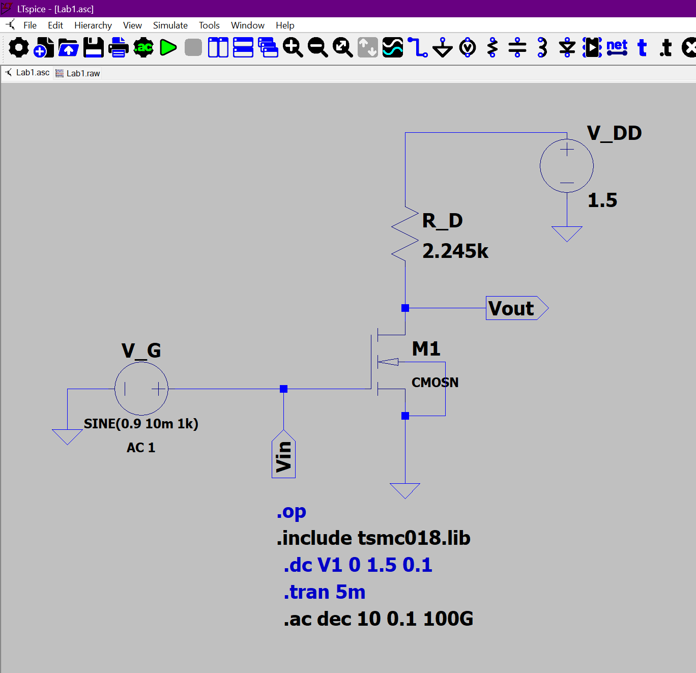
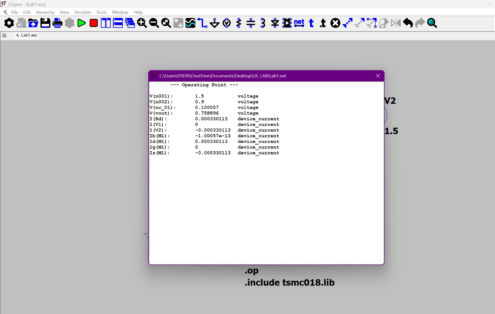

# Experiment – 1  
## DC, Transient and AC Analysis of Common Source Amplifier using 180nm NMOS in LTspice

---

## AIM :

To design a Common Source (CS) amplifier using 180nm NMOS technology in LTspice and to perform DC, Transient and AC analysis as per the given specifications.

---

## GIVEN SPECIFICATIONS :

- VDD = 1.5 V  
- Power constraint P ≤ 0.5 mW  
- Load capacitor CL = 1 pF  
- Channel length L = 180 nm  
- Technology : 180 nm TSMC library  

---

## COMPONENTS USED :

- NMOS transistor (180nm model)  
- Drain resistor (RD)  
- DC power supply  
- AC signal source  
- Load capacitor (1 pF)  
- Ground and connecting wires  
---

## CIRCUIT DIAGRAM :

The Common Source amplifier circuit was designed in LTspice using 180nm NMOS technology.  
The drain resistor RD is connected between VDD and drain terminal.  
The input signal is applied at the gate terminal and output is taken from the drain.  

---

## THEORY :

A Common Source (CS) amplifier is one of the fundamental MOSFET amplifier configurations.  
In this configuration, the source terminal is grounded, the input is applied at the gate and the output is taken from the drain.
The amplifier provides voltage gain with a phase inversion of 180 degrees between input and output.  
For proper amplification, the MOSFET must operate in the saturation region.  
Therefore, the Q-point is fixed such that VDS ≈ VDD/2 to allow maximum symmetrical output swing.

## PROCEDURE :

1. The 180nm NMOS model file (tsmc018.lib) was included in LTspice using the .include directive.

2. The Common Source amplifier circuit was constructed with:
   - VDD = 1.5 V  
   - Drain resistor RD ≈ 2.245 kΩ  
   - NMOS transistor with L = 180 nm and W = 2.5 µm    

3. DC analysis was performed using the .op and .dc commands to determine the Q-point by setting VDS ≈ VDD/2.

4. RD was adjusted and W/L ratio was varied to achieve the required drain current under the power constraint (P ≤ 0.5 mW).

5. Transient analysis (.tran 5m) was carried out using a sine input SINE(0.9 10m 1k) to observe linear and non-linear behavior.

6. AC analysis (.ac dec 10 0.1 100G) was performed to obtain frequency response and determine gain and bandwidth parameters.
   
## DC ANALYSIS AND CALCULATIONS

To fix the Q-point at VDS ≈ VDD/2, the drain current was first calculated using the power constraint.

Given:

P ≤ 0.5 mW  
VDD = 1.5 V  

Using,

P = V × I  

0.5 mW = 1.5 × ID  

Therefore,

ID = 3.34 × 10⁻⁴ A  
ID ≈ 0.334 mA  

For maximum symmetrical swing,

VDS = VDD / 2  
VDS = 1.5 / 2 = 0.75 V  

The drain resistor was calculated using:

RD = (VDD − VDS) / ID  

RD = (1.5 − 0.75) / (3.34 × 10⁻⁴)  

RD ≈ 2.245 kΩ  

The transistor width was initially calculated using the MOSFET saturation current equation:

ID = (kn'/2) × (W/L) × (VGS − Vth)²  

From calculations,

W ≈ 1.83 µm  

After simulation tuning to achieve correct Q-point,

Final selected W = 2.5 µm  

The obtained DC operating point from LTspice:

ID ≈ 0.33 mA  
VDS ≈ 0.75 V  

Thus, the Q-point was successfully fixed near mid-supply.
### DC Simulation Result

## DC PARAMETER VARIATION STUDY

### (a) Effect of Varying RD (For Fixed W/L)

The width and length of the transistor were kept constant (W = 2.5 µm, L = 180 nm).  
The drain resistor RD was varied to observe its effect on the Q-point.

Observation:

- Increasing RD increases the voltage drop across RD.
- As RD increases, VDS decreases.
- Drain current slightly reduces for larger RD values.
- Proper RD selection is required to maintain VDS ≈ VDD/2.

Thus, RD ≈ 2.245 kΩ was selected to obtain VDS ≈ 0.75 V.
### DC Sweep Result

The DC sweep of input voltage was performed from 0 V to 1.5 V to observe variation in supply current and verify the power constraint.

---

### (b) Effect of Varying W (For Fixed RD)

The drain resistor was kept constant at RD ≈ 2.245 kΩ.  
The transistor width (W) was varied to analyze its effect on drain current.

Observation:

- Increasing W increases drain current.
- Larger W shifts the Q-point due to higher ID.
- Smaller W reduces ID and moves VDS closer to VDD.

From simulation tuning, W = 2.5 µm provided the required drain current (≈ 0.33 mA) and correct biasing.
### DC Transfer Characteristic (Vout vs Vin)

The DC sweep was performed by varying input voltage from 0 V to 1.5 V.  
The variation of output voltage with respect to input voltage is shown below.

## TRANSIENT ANALYSIS

Transient simulation was performed using:

.tran 5m

A sine input of SINE(0.9 10m 1k) was applied at the gate terminal.

### Input Waveform (Vin)

### Output Waveform (Vout)

### Observation

- Output waveform is inverted with respect to input (≈ 180° phase shift).
- Peak output voltage ≈ 780 mV
- Peak input variation ≈ 10 mV
- Voltage gain ≈ 2.08
- The amplifier operates in saturation region.

Thus, transient analysis confirms proper biasing and amplification.

...

### Gain Calculation

From transient waveform:

Gain (Av) = Vout / Vin  

Measured practical gain ≈ 2.087  

Gain in dB:

Av(dB) = 20 log(2.087)  

Av ≈ 6.39 dB  

The theoretical gain using:

Av = gm × RD  

was approximately 2.808  

Theoretical gain in dB ≈ 8.94 dB  

Thus, practical gain is slightly lower than theoretical gain due to non-ideal effects.
## AC ANALYSIS

AC analysis was performed using:

.ac dec 10 0.1 100G

The frequency response was obtained to determine gain and bandwidth.

### Observations

- The amplifier shows constant gain in the midband region.
- At higher frequencies, gain decreases due to parasitic capacitances.
- The presence of load capacitor (CL = 1 pF) reduces the bandwidth.

### Extracted Parameters

From AC plot (with CL = 1 pF):

- Midband gain ≈ 2.087
- Gain in dB ≈ 6.39 dB
- 3 dB bandwidth ≈ 89.65 MHz
- Unity Gain Bandwidth (UGB) ≈ 150.23 MHz
- GBP ≈ 2.087 × 89.65 MHz
     ≈ 187 MHz (approx)

### AC Response Without Load Capacitor

### AC Response With Load Capacitor (CL = 1 pF)

## OVERALL COMPARISON TABLE

| Parameter | Theoretical Value | Practical (Simulation) Value |
|------------|------------------|------------------------------|
| Drain Current (ID) | ≈ 0.334 mA | ≈ 0.33 mA |
| VDS (Q-point) | 0.75 V | ≈ 0.75 V |
| Drain Resistor (RD) | 2.245 kΩ | 2.245 kΩ |
| Transistor Width (W) | 1.83 µm (calculated) | 2.5 µm (adjusted) |
| Voltage Gain (Av) | 2.808 | 2.087 |
| Gain (dB) | 8.94 dB | 6.39 dB |
| 3 dB Bandwidth | — | 89.65 MHz |
| Unity Gain Bandwidth (UGB) | — | 150 MHz |
| Gain Bandwidth Product (GBP) | — | ≈ 187 MHz |
## INFERENCE

1. The Common Source (CS) amplifier was successfully designed using 180 nm NMOS technology under the given power constraint of 0.5 mW.

2. From DC analysis, the Q-point was properly fixed at  
   **VDS ≈ 0.75 V (≈ VDD/2)**  
   ensuring maximum symmetrical output swing.

3. The calculated drain current (0.334 mA) closely matched the simulated value (≈ 0.33 mA), confirming correct bias design.

4. Transient analysis verified that the amplifier provides voltage amplification with a **180° phase inversion**, which is the fundamental characteristic of a CS amplifier.

5. The practical voltage gain (≈ 2.087 or 6.39 dB) was slightly lower than the theoretical gain due to non-ideal device parameters and parasitic capacitances.

6. AC analysis showed a flat midband gain region followed by gain roll-off at higher frequencies.

7. The 3 dB bandwidth was approximately **89.65 MHz**, and the Unity Gain Bandwidth (UGB) was around **150 MHz**.

8. It was observed that adding a load capacitor (CL = 1 pF) reduced the bandwidth while maintaining nearly the same midband gain.

9. Overall, the simulated results closely agree with theoretical expectations, validating the design methodology.

